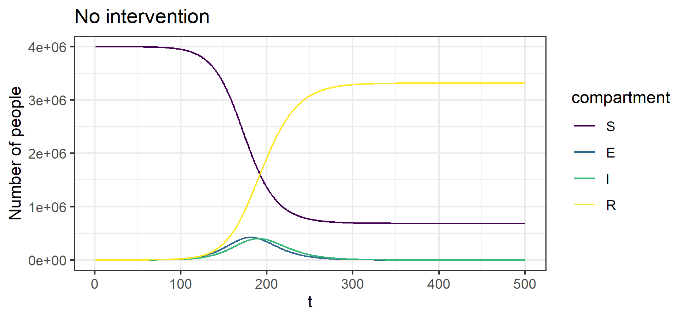
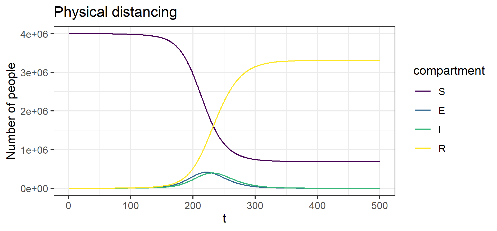
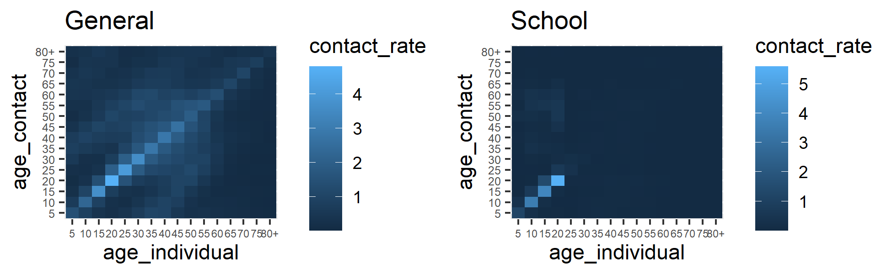

# COVID-19 Open-source Infection Dynamics (COVOID)

  <!-- badges: start -->
  [](https://github.com/CBDRH/covoid/actions)
  <!-- badges: end -->

COVOID is a R package for modelling COVID-19 and other infectious diseases using deterministic compartmental models (DCMs). It contains a built-in Shiny app enabling easy use and demonstration of key concepts to those without R programming backgrounds, along with an expanding API for simulating and estimating homogeneous and age-structured SIR, SEIR and extended models. In particular covoid allows the simulataneous simulation of age specific (e.g. school closures) and general interventions over varying time intervals.

## Acknowledgements

Work on COVOID is facilitated by the genrous assiatnce of Ian Sharp, philanthropic supporter of UNSW research. 

If you would like to support our work, please click on the **Sponsor** button at the top of this page for details of how to donate.

## Modelling COVID-19

* Shiny app, screenshot, links.

For information on installing COVOID and a basic illustrating of the programming API keep reading, or visit the [COVOID website](www.cbdrh.github.io/covoid) for more information. Click [here](www.cbdrh.github.io/covoid) to use the interactive Shiny platform.

## Installation

You can install the development version of covoid from
[GitHub](https://github.com/) with:

```r
# install.packages("devtools")
devtools::install_github("cbdrh/covoid",build_vignettes = TRUE)
```
## Example

This is a basic introduction to covoid package syntax. We demonstrate how to simulate an epidemic along with the impact of disease prevention policies using an age structured SIR model. The populations demographics are matched to that of Australia, with a population of 4 million and 10 initial cases. The functions `import_contact_matrix` and `import_age_distribution` import data from Prem et al (2017) and the United Nations Population Division (2019) on age specific contact rates and distributions, both grouped by 5 years. There are ~150 countries with both contact and age demogrpahic information available in covoid.

```r
library(covoid)
cm_oz <- import_contact_matrix("Australia","general")
p_age_oz <- import_age_distribution("Australia")
# initial conditions
S <- p_age_oz*4e6
I <- c(0,0,0,0,5,3,1,2,0,0,0,0)
R <- rep(0,length(S))
```
We first consider the case without any interventions, in which the epidemic runs its course. The `sir_c_param` takes uses the basic reproduction number `R0` and the inverse of the average disease length `gamma` to parameterise the system of ODEs, and infer other parameters such the probability of disease transmission.

```r
param <- sir_c_param(R0 = 2.5,gamma = 0.1,cm=cm_oz,dist=p_age_oz)
state0 <- sir_c_state0(S0 = S0,I0 = I0,R0 = R0)
res <- simulate_sir_c(t = 200,state_t0 = state0,param = param)
plot(res,y=c("S","I","R"),main="No intervention")
```


We can add in time varying interventions that reduce contact rates across the population using `create_contact_intervention`. The below example reduces all physical contact by 20% in order to simulate physical distancing.

```r
phys_dist = contact_intervention(start = 10,stop = 150,reduce = 0.8,start_delay = 5,stop_delay = 5)
param <- sir_c_param(R0 = 2.5,gamma = 0.1,cm=cm_oz,dist=p_age_oz,contact_intervention = phys_dist)
state0 <- sir_c_state0(S0 = S0,I0 = I0,R0 = R0)
res <- simulate_sir_c(t = 200,state_t0 = state0,param = param)
plot(res,y=c("S","I","R"),main="Physical distancing")
```



The covoid package also allows you to separate the contact rates into different settings - e.g. school, work and home. 

```r
cm_oz_all <- import_contact_matrix("Australia","general")
cm_oz_sch <- import_contact_matrix("Australia","school")
# separate out school and general population contact rates
cm_oz_all = cm_oz_all - cm_oz_sch
p_all <- plot(cm_oz_all) + labs(title = "General") +
  theme(axis.text.x = element_text(size=6, angle=0),
          axis.text.y = element_text(size=6))
p_sch <- plot(cm_oz_sch) + labs(title = "School") +
  theme(axis.text.x = element_text(size=6, angle=0),
          axis.text.y = element_text(size=6))
gridExtra::grid.arrange(p_all,p_sch,ncol=2)
```



We can then add in time varying interventions using `create_intervention` to each setting. The below example reduces general contact by 20% to simulate physical distancing combined with a reduction in school age contact by 80% to simulate school closures.

```{r}
cm = list(all = cm_oz_all, sch = cm_oz_sch)
int = list(sch=contact_intervention(start = 10,stop = 150,reduce = 0.2,start_delay = 5,stop_delay = 5),
           all=contact_intervention(start = 10,stop = 150,reduce = 0.8,start_delay = 5,stop_delay = 5))
param <- sir_c_param(R0 = 2.5,gamma = 0.1,cm=cm,dist=p_age_oz,contact_intervention = int)
state0 <- sir_c_state0(S0 = S0,I0 = I0,R0 = R0)
res <- simulate_sir_c(t = 200,state_t0 = state0,param = param)
plot(res,y=c("S","I","R"),main="Physical distancing + school closures")
```


For more information see `vignette(package = "covoid")` or visit the [COVOID website](www.cbdrh.github.io/covoid)

## References

Prem, K., Cook, A. R., & Jit, M. (2017). Projecting social contact matrices in 152 countries using contact surveys and demographic data. PLoS computational biology, 13(9), e1005697.

United Nations, Department of Economic and Social Affairs, Population Division (2019). World Population Prospects 2019, Online Edition. Rev. 1.
